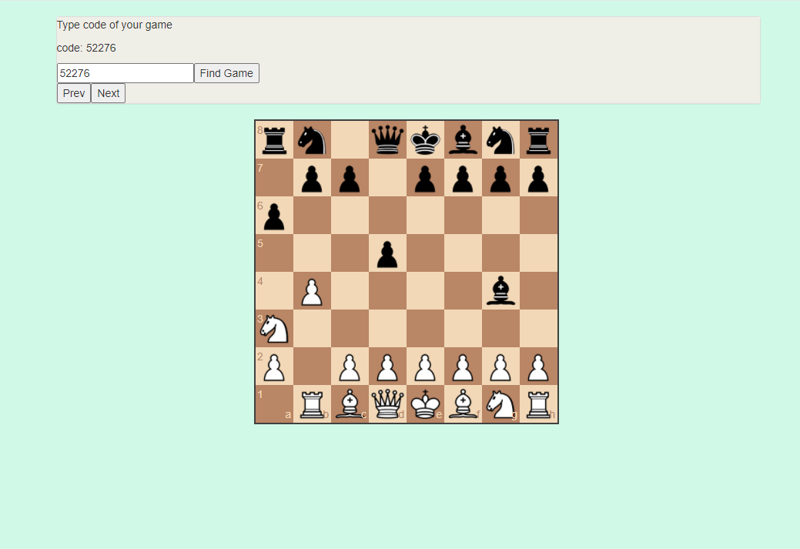
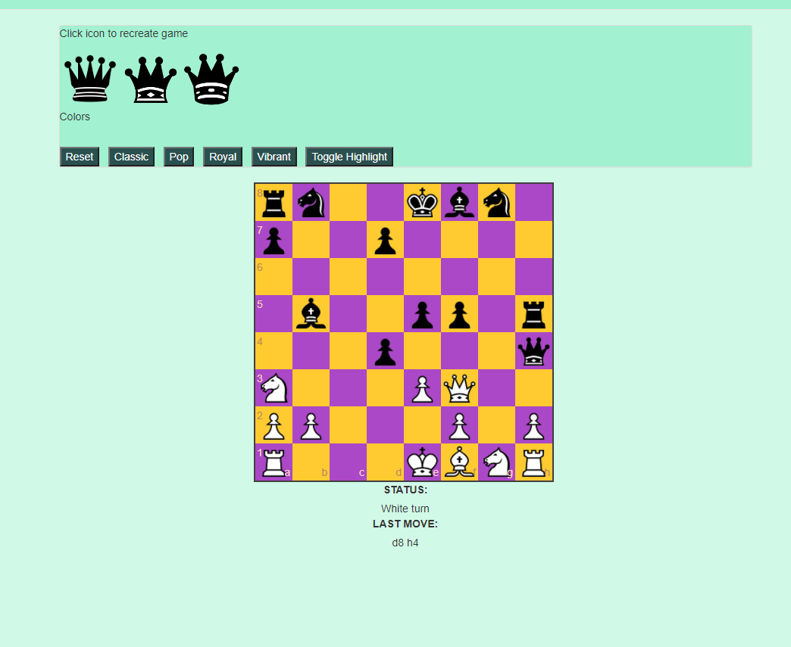

# Project-2: Chess App 

## Notes

* This is a project I worked on with a small group at revature. I was responsible for the back-end, server-side portion of the application. I made use of the Spring framework, including modules like SpringMVC. I earned valuable experience communicating with the front-end team, ensuring that my systems were able to communicate with theirs and perform the required work.

## Team Members:

* Suva Shahria
* Matthew LaFleur
* Max Goncharov
* Andrew Curry

## Executive Summary
Chess App is a full-stack web application that allows users to login and play chess against each other online. Users can challenge other users to a game. Replay old games that they've played. Users can customize the theme of the board and the pieces.

## Chess App User Stories 
* Users can register and create a new account. 
* Users can login.
* Users can reskin the chessboard and chess pieces according to their preferences. 
* Users can challenge other users to a chess match over the internet.
* Users can play chess against other users online.
* Users can replay their old games.
* Users can view all users, their incomplete games, and pending games. 
* Users can logout. 

## Technology Stack

### Front-End
* We used **Angular**, **Bootstrap**, **HTML**, **CSS**, **JavaScript**, and **TypeScript** to create the front-end of the application.
* We implemented **chess.js API** and **chessboard.js API** for the chess logic and chessboard graphics. 

### Back-End
* We used **SpringMVC** to leverage the Dispatcher-Servlet to create a FrontController design pattern to communicate with the back-end.
* The back-end system uses **SpringMVC** along with **Hibernate** to connect to an **AWS RDS Postgres database**. 
* Passwords are encrypted in **Java** and securely stored in the database. 
* The middle tier follows proper layered architecture and has reasonable (~70%) test coverage of the service layer. 

### Misc
* **GitHub** and **GitBash** for version control.
* **Slack**, **Zoom**, and **Discord** for team communication and stand-up meetings.
* We employed the **scrum** methodology and the **agile** development framework during the two-week sprint.

## Sample Views

